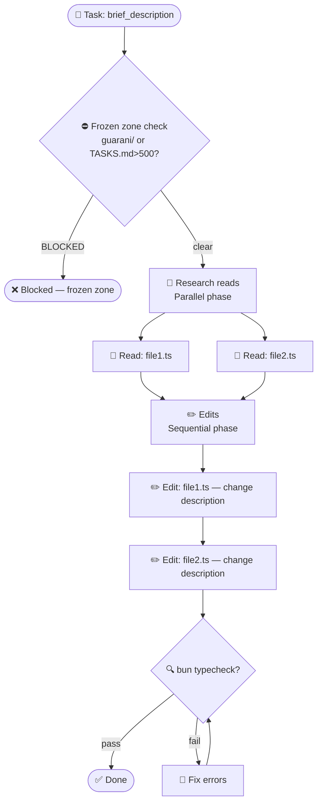

# /coordinator — Multi-Agent Orchestration (EGOS)

> Launches a 4-phase coordinator session: Research → Synthesis → Implementation → Verification.
> Inspired by Claude Code Coordinator Mode (LEAK-003).

## Arguments

`$ARGUMENTS` = task description (e.g., "implement Eagle Eye Telegram alerts", "refactor shared/src/cache.ts")

## Phase 0: Architecture Decision (GH-047)

Before spawning any agents, select the optimal coordination architecture using `packages/shared/src/intelligence/architecture-selector.ts`:

```
Input assessment:
- taskComplexity (0–10): trivial=2, moderate=5, complex=8, cross-repo=10
- agentCount: how many agents will be spawned?
- interdependenceLevel (0–10): independent batch=2, sequential pipeline=5, full synthesis=8
- latencyTolerance (0–10): blocking P0=1, normal=6, async/scheduled=9

Run mentally: selectArchitecture(input) → architecture type + rationale
```

**Output line (insert at top of Phase 2 plan):**
```
🏗 Architecture: `<type>` | Error amplification: <N>× | Rationale: <rationale>
```

Architecture → agent spawning pattern:
- `centralized` → 1 orchestrator, N leaf agents, all report back
- `decentralized` → N independent agents in parallel, merge results post-hoc
- `hierarchical` → top orchestrator → domain leads → leaf agents
- `mesh` → small agent set, all share intermediate outputs (debate/review pattern)
- `federated` → isolated domain clusters + thin coordinator

---

## Phase 1: Research (Parallel Reads)

Following LEAK-008 (read-parallel/write-sequential):

Launch ALL reads simultaneously — do NOT wait for one before starting another:

```
Spawn Explore agents in parallel:
1. Codebase structure: What files are relevant to this task?
2. External context: Is there documentation/API specs to fetch?
3. Dependency analysis: What calls what? (use codebase-memory-mcp trace_call_path)
4. Existing patterns: How does the codebase handle similar problems?
```

Collect all results before advancing to Phase 2.

## Phase 2: Synthesis

With all research complete:

1. **Map the task** — list every file that will be created or modified
2. **Identify dependencies** — which changes are independent vs sequential?
3. **Check frozen zones** — verify no `.guarani/` or TASKS.md (>500 lines) modifications
4. **Estimate scope** — "trivial" (<3 files, no new APIs) / "moderate" (3-10 files) / "complex" (10+ files or new integrations)
5. **Present plan to user** — wait for approval before Phase 3 if scope is "complex"
6. **Emit Mermaid GRD** — Graphical Reasoning Diagram for BRAID execution (see below)

```
Format:
## Coordinator Plan: [task name]
- Files to modify: X
- New files: Y
- Estimated scope: trivial/moderate/complex
- Blocking dependencies: [none | list]
- Proposed order: [sequential list]
```

### GRD — Guided Reasoning Diagram (BRAID Mode)

After the prose plan, emit a Mermaid `graph TD` showing task decomposition as nodes (work units), edges (dependencies), and terminal states.

**Template structure:**



**Node type conventions:**
- `([...])` = terminal: START, DONE, FAIL/BLOCKED
- `{...}` = decision/guard: frozen zone check, verification gates
- `[...]` = action: read, edit, run
- subgraph = phase groupings (optional, for clarity)

**Edge rules:**
- `A & B --> C` = parallel A and B feed into C
- `A -->|label| B` = labeled edges for guard outcomes
- `A --> B --> C` = sequential; show each step

**GRD purpose:** Once emitted, this is the execution contract for Phase 3. Cheap models (Haiku, Hermes) execute node-by-node strictly — no re-reasoning. This is the BRAID pattern (74–122× cheaper execution).

## Phase 3: Implementation (Sequential Writes)

Execute changes by traversing the GRD node-by-node in dependency order:

```
For each node in the GRD:
  1. Identify the node's action (Read, Edit, Run, Verify)
  2. Check preconditions (did all incoming edges complete?)
  3. Execute the action:
     - Read: use the Read tool on the specified file
     - Edit: modify the file using the Edit tool
     - Run: execute the specified command (typecheck, test, etc.)
     - Verify: check the outcome; if pass → proceed; if fail → follow feedback edge
  4. Mark node complete
  5. Move to next node(s) with satisfied dependencies
```

**Key rules:**
- **Never modify 2 files in the same repo simultaneously.**
- **After every 3 edits: pause and re-read TASKS.md to stay on track.**
- **Cheap model execution:** If using Haiku/Hermes, follow the GRD strictly — no re-reasoning, just node execution.
- **If scope expands:** Re-run Phase 2 to regenerate the GRD before continuing.

Commit in logical phases:
- Phase 3a: foundation changes (types, interfaces)
- Phase 3b: implementation (logic)
- Phase 3c: integration (wiring)

## Phase 4: Verification

After all changes:

```bash
# Run all relevant checks
bun run typecheck     # TypeScript
bun run test          # Unit tests (if configured)
bun run build         # Build check
bun run governance:check  # EGOS governance (if structural change)
```

If anything fails: fix before reporting done.

Final report:
```
## Coordinator Result: [task name]
- Files changed: X
- Tests: passing/failing/none
- Typecheck: clean/X errors
- Governance: clean/drift
- Commits: [list]
```

## Rules

- **NEVER skip Phase 2 synthesis** for any task (even "trivial")
- **NEVER write to a file** you haven't read in this session
- **NEVER report done** until Phase 4 verification passes
- **GRD is required** — emit for ALL scope levels. GRD must include frozen-zone guard + terminal states
- **GRD must be accurate** — reflect actual files from Phase 1, no hypothetical nodes
- If scope expands mid-implementation: pause, re-run Phase 2 (emit new GRD), then continue
- Label facts vs inferences vs proposals throughout
- If using cheap models for Phase 3: execute GRD nodes strictly, no re-reasoning
